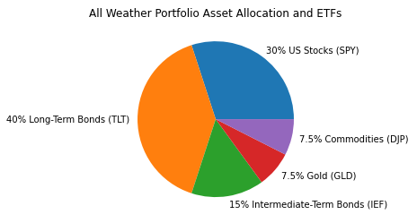
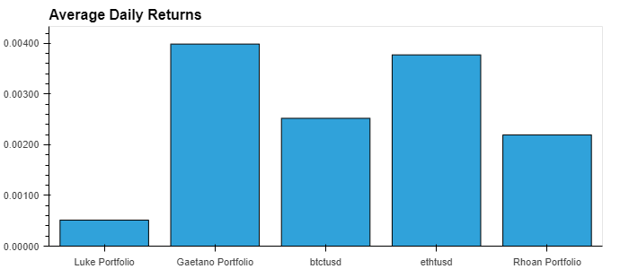
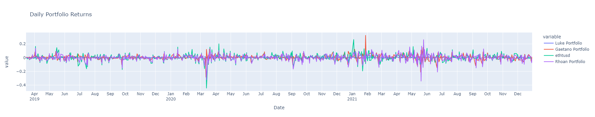
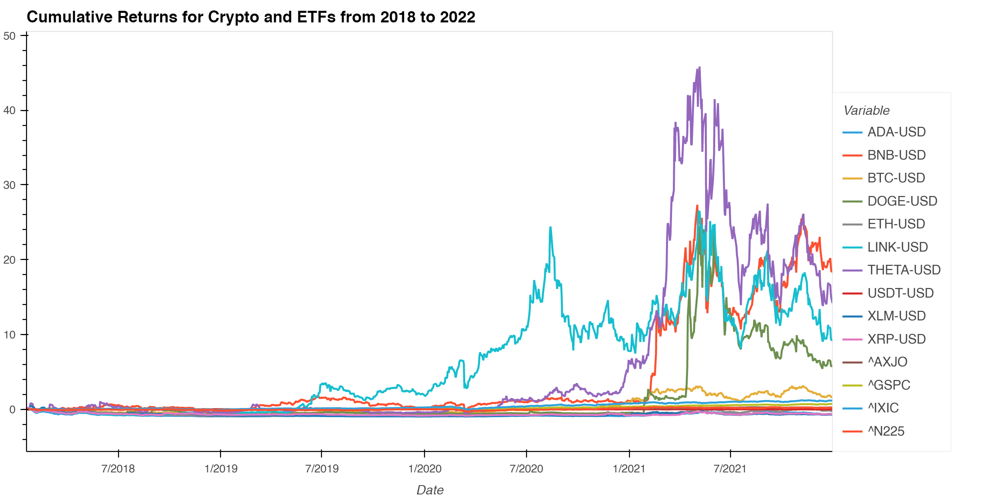

# Group F - Portfolio Analysis 

# This project is aimed at highlighting the daily returns for multiple multi-asset portfolios. 

## Introduction

In the past the only thing a savy investor had to do was arguably leave there money in a term deposit account sometimes averaging a return ggreater than >10% p.a.! However, those days are long gone with the current interest rate below a couple percent. To combat this our team are here to help potential investors understand and potentially identify other vehicles they can use to grow their capital. To do this our team have analysed 3 individual portfolios made up of various assets and from this observe various characteristics and returns of each one.

---

## Background

Together our team worked together to come up with an individual portfolio each. Each of our portfolios were constructed using individual asset classes and some contained negative correlated assets to improve diversification and reduce beta within the portfolios. 

---

---

## Process

Each of our team members sourced data from various sources utilising yfinance, cryptowatch, coingecko and alpacas. Each group member cleaned and reformatted their data which allowed for all of us to use comparative analysis of the portfolios returns.

---

## Findings

After pulling all the data together our team has discovered that each of our portfolio had a range of characteristics.

As we can observe in the above graph the standard deviation of all the portfolios have very similar shapes except for Lukes's Portfolio.
This is arguably because a large portion of all the other portfolios have a large allocation to BTC holdings within their portfolios.
However, during March 2020, it can also be observed in the image that there had been a significant event. Out team have identified the 'significant event' as the liquidity crisis brought on by the sudden impact of COVID-19.

Other findings which our team have idenitified can be quantified by the below image:

In the above graph it can be observed that all of our portfolios have a positive sharpe ratio. Not only this but all the portfolios which our team have created from the data have a sharpe ratio >1 which is arguably demonstrates the portfolios abilty to achieve better returns relative to its risk and volatility.
From this graph one portfolio stood out and it is pretty clear to see that this portfolio was Gaetano's Portfolio.

As we can see in the above graph there were multiple individual assets which made up the portfolio which have extremely high daily returns with some managing multipl 40% gains within a day. This extreme price volatility is highlighted particularly well in the below graph which shows our portfolios next to each other in a box plot to demonstrate portfolio volatility.

---

## Conclusion

In conclusion our team have highlighted the 3 individual portfolios which consist of multiple assets to highlight portential returns and the risks associated with each one. Our team were unable to recommend any particular portfolio as we do not have the expertise but each one of the individual portfolios each has their own positives and negatives. 

---

### Built with:
* python
* pandas
* numpy
* alpaca
* cryptowatch
* pycoingecko
* yfinance
* matplotlib
* MCForecastTools
* panel
---
### Sources:
[What leads to high interest rates?](https://www.pbs.org/newshour/economy/what-led-to-the-high-interest)

[Sky high interest rates?](https://finance.yahoo.com/blogs/just-explain-it/why-mortgage-rates-matter-152241574.html?guccounter=1&guce_referrer=aHR0cHM6Ly93d3cuZ29vZ2xlLmNvbS8&guce_referrer_sig=AQAAAIDGhRTA-hnSMiJvqEUgjbpTt1E1TUCp9qT-mdrR5i0iHS34VNfcBM96bFwpzuSi9FrGF53Z8RQMuPCoJI23U5JzrBUtiWhkr48iYGT8BhTjcrybVpUtDIJ7tb8TZs0rp4bDvCkhSU7UHkZX9Ralj9pCE-w-dmhKMiKWmBdX60SM)

[Reduce volatility in your portfolio](https://www.investopedia.com/financial-edge/0312/how-to-reduce-volatility-in-your-portfolio.aspx#:~:text=If%20the%20beta%20is%20below,them%20with%20lower%20beta%20names.)

[How to build a portfolio](https://online.hbs.edu/blog/post/how-to-diversify-your-portfolio#:~:text=To%20diversify%20your%20portfolio%2C%20select,a%20high%20level%20of%20complementarity.)

[Investing in uncertain times](https://www.forbes.com/sites/duncanrolph/2017/01/13/investing-in-times-of-uncertainty/?sh=57478f85139e)

[Managing a liquidity crisis](https://hbr.org/2020/04/managing-the-liquidity-crisis)

---