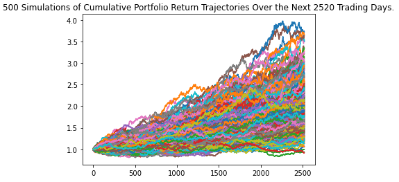
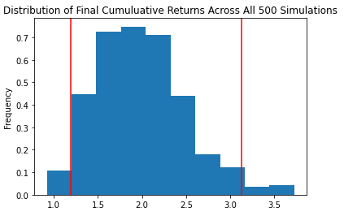

# Portfolio Analyser - Group F Project 1

### This repository is a portfolio analyser that includes calculations, charts, Monte Carlo simulations and statistical analysis of portfolio performances.

---

## Background

Our group worked on three individual portfolios before bringing them together to analyse and compare. 

---

## Process

We sourced the data by utilising yfinance, cryptowatch, pycoingecko and alpaca. Each group member cleaned and reformatted their data then performed statistical analysis before merging the data frames to summarise.  

---

## Findings

...

---

## Built with
* python
* pandas
* numpy
* alpaca
* cryptowatch
* pycoingecko
* yfinance
* matplotlib
* MCForecastTools
* panel

---